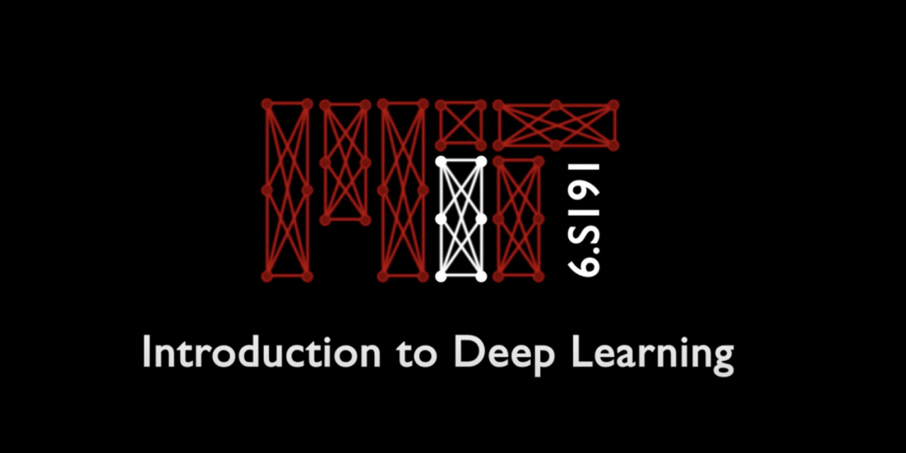

# Deep Learning
  
For more details on the course contents check the [Official Course Page](http://introtodeeplearning.com/).

## Overview
The Deep Learning Repository contains the projects made following MIT's 6.S191 Introduction to Deep Learning Course.  
 
## Table of Contents
- [Prerequisites](#prerequisites)
- [Installation](#installation)
- [Projects Table](#project-table)
- [Technologies Used](#technologies-used)
- [License](#license)

## Prerequisites
Before you begin running the Jupyter notebooks for deep learning, ensure you have the following:

1. **Google Colab Account**: Necessary for executing the notebooks on Google's infrastructure.
2. **Internet Connection**: Required to download the repository and access external resources.

## Installation
Follow these steps to set up and run the Jupyter notebooks for deep learning from the repository:

1. **Clone the Repository**: 
   Open a terminal or command prompt and run the following command to clone the repository to your local machine:
   ```bash
   git clone https://github.com/antonio-hus/Deep-Learning.git
   ```

2. **Open Google Colab**:
   Upload the notebooks to your Colab account and run them there.

## Projects Table
You can view more in-app images & project related documents in the Images folder:  

1. **Music Generation**  
Description: We will play around with building a Recurrent Neural Network (RNN) for music generation. We will be using a "character RNN" to predict the next character of sheet music in ABC notation. Finally, we will sample from this model to generate a brand new music file that has never been heard before!  

2. **Digit Classification**  
Description: We will build and train a convolutional neural network (CNN) for classification of handwritten digits from the famous MNIST dataset. The MNIST dataset consists of 60,000 training images and 10,000 test images. Our classes are the digits 0-9.  
   
3. **Facial Detection**  
Description: We will investigate [one recently published approach to addressing algorithmic bias](http://introtodeeplearning.com/AAAI_MitigatingAlgorithmicBias.pdf). We'll build a facial detection model that learns the latent variables underlying face image datasets and uses this to adaptively re-sample the training data, thus mitigating any biases that may be present in order to train a debiased model.  
   
4. **Cartpole Balancing**  
Task: Balance a pole, protruding from a cart, in an upright position by only moving the base left or right. Environment with a low-dimensional observation space.  

5. **Autonomous Driving**  
Task: Learn a driving control policy for an autonomous vehicle, end-to-end from raw pixel inputs and entirely in the data-driven simulation environment of VISTA. Environment with a high-dimensional observation space -- learning directly from raw pixels.   


## Technologies Used
- **Tensorflow & Keras API**: Used to develop the AI Models.
- **Python**: Used in pair with Tensorflow.

## License
The projects are developed following the MIT's 6.S191 Introduction to Deep Learning Course lab requirments and thus fall under MIT's license - [License Page](https://github.com/aamini/introtodeeplearning/blob/master/LICENSE.md).  
